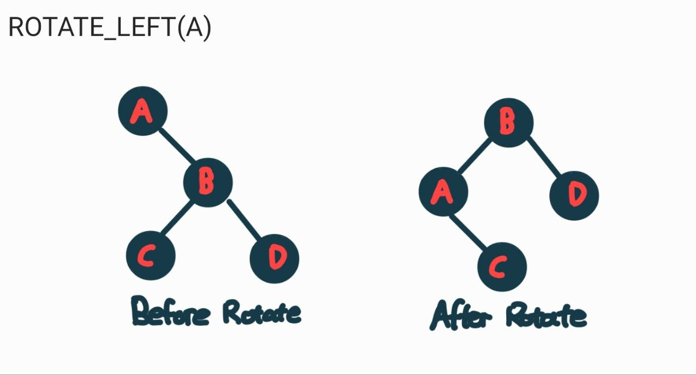
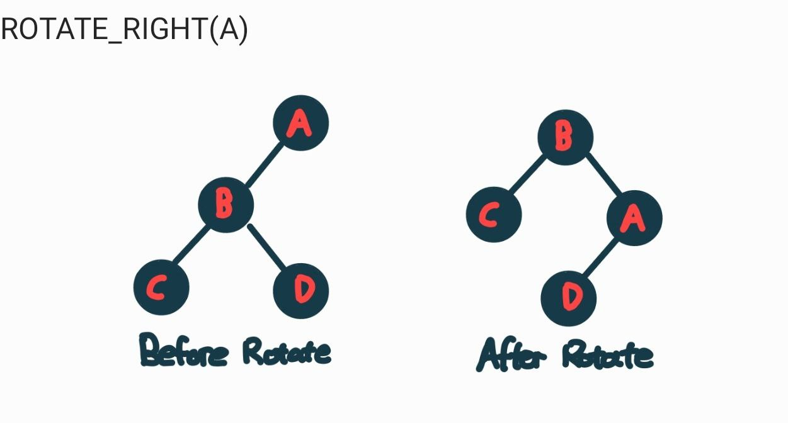

``
---
# Title page

<div align="center">
  <table>
    <tr>
      <th>Team Members</th>
      <th> Student id</th>
    </tr>
    <tr>
      <td>Ryan</td>
      <td>Data 2</td>
    </tr>
        <tr>
      <td>Kendrix</td>
      <td>Data 2</td>
    </tr>
        <tr>
      <td>Shana</td>
      <td>Data 2</td>
    </tr>
        <tr>
      <td>Jing Jie</td>
      <td>Data 2</td>
    </tr>
        <tr>
      <td>Darren</td>
      <td>Data 2</td>
    </tr>
        <tr>
      <td>Gerald</td>
      <td>Data 2</td>
    </tr>
        <tr>
      <td>Donovan</td>
      <td>Data 2</td>
    </tr>
  </table>
</div>

---
# Executive summary

The **Tier Membership** system consists of four tiers: **Bronze, Silver, Gold, and Platinum**. Every member starts at the Bronze tier with 0 points. To advance to Silver, a user must accumulate at least **500 points**. However, progression to **Gold** or **Platinum** is competitive and only the top users each week will be able to promote into these tiers, based on a weekly ranking system.

Our proposed solution implements a relational database with 2 tables: a **User table** and a **Reward Points table**. The database's underlying data structure ensures an **O(1)** time complexity whenever the user retrieves their own points. Furthermore, the **User table** would use database indexing to ensure the system lookups would be **O(log n)**.

The **Reward Points table** would be implemented as a **Red Black Tree**, which is a type of self-balancing Binary Search Tree (BST). This algorithm provides efficient sorting and searching while maintaining a balanced tree structure, ensuring O(log n) time complexity for search operations. The Red Black Tree offers a better balance between search and update performance as compared to the AVL tree, which has faster lookups at the cost of more rotations to maintain the tree's balance during insertions and deletions.

---
# Database diagram
==Figure 1== 
<div align="center">

</div>

==Figure 1== is a high-level overview of the tables. These tables would have a **one to one relationship**, where the `points_id` column in the User table serves as a foreign key referencing the Primary key (`id`) in the Reward_Points table. This ensures that whenever the user's points need to be retrieved and displayed in their own account, it would only take **O(1)** time.

==Figure 2== 
<div align="center">

</div>

> [!Take note that in Figure 2, the key is used for indexing, while Index (e.g Index:15) points to the actual index in the database]

Searching for a person's username and id in the `users` table could result in $O(n)$ complexity if we use a trivial sequential search approach. To optimise lookups, the **User** table should implement database indexing. This allows the database to jump directly to the relevant sections instead of iterating through the data. As shown in ==Figure 2==, indexing uses a structure, similar to B-tree, which ensures **O(log n)** time complexity for searching.

(maybe add actual example here)

However, **Reward points** table should not use database indexing. This is due to the frequent updates and changes in the table (explained in [[2D report#User Ranking System]]). Although B-tree's are great for searching, they slow down when operations like insert, update and delete happen. These operations add overhead, as for each operation, the database would have to keep rebuilding and reorganising the data structure and possibly rebalancing the trees, slowing down the performance.

(Should i explain b-tree oso??)

---
# User Ranking System

The ranking system is designed in a way to incentivise user engagement and reward top-performing users. There are 4 tiers in this system (Bronze, Silver, Gold and Platinum). A user can gain points by gaining likes and comments on their posts and videos. They would lose points by receiving dislikes and reports. Rank progression is determined by a weekly leaderboard, where high performing users, are promoted, and low performing users are demoted. Weekly rankings are only based on points accumulated **only** in that week.

## Ranking Progression Rules
- **Bronze to Silver**
	- Bronze tier users would be promoted to Silver upon obtaining 1000 points.
	- Users would not be able to demote from Bronze to Silver.
- **Silver to Gold**
	- Silver tier users in the top 20% of the weekly leaderboard would be promoted to Gold.
- **Gold to Platinum**
	- Gold tier users in the top 10% of the weekly leaderboard would be promoted to Platinum.
   
#### Demotion Rules
To ensure user engagement and competitive fairness, Gold and Platinum players have to maintain their rankings.
- If a **Gold** user is in the bottom 20%, the user will be demoted to Silver
- If a **Platinum** user is in the bottom 10%, the user will be demoted to Gold.

A **Silver** user is not able to be demoted to Bronze. This allows the user to have a sense of accomplishment reinforcing a positive user experience. Furthermore, by preventing the demotion to bronze, it ensures motivation for those users who had a temporary decline in activity for the week.

# Algorithms
The data structure used to store the **User** table would be a HashMap.  HashMap offers average-case O(1) time complexity for insertion, deletion and lookups ,making it much faster than most algorithms. While HashMap has a worst-case time complexity of O(n) due to collisions (adding all into one key) , this can be negated by choosing an effective hash function and maintaining a low load factor. %% and maybe bronze tiers  %% 

```
Class HashMap():
	Table <- An array of list     // Create default hash map
	size <- 0                     //default size
```

(continue here) 

The algorithm used to store **Reward Points** table would be the **Red-Black Tree** algorithm. It is an modified version of the Binary Search Tree. It is also offers faster insertions and deletions than the AVL tree, due to the lesser amount of rotations when restructuring the tree.

<div align="center">

</div>

In a red-black tree:
- A node can only be black or red
- The root and leaf nodes are black
- If a node is red, then the children nodes are black
- ALL paths from a node to its descendants should have the same number of black nodes

##### Node Class
```
Class Node(user_id):
	Requires: a new user id from the User table
	
	String color  <- "red"       // Default color of new nodes are red
	integer points <- 0         // Default membership points
	integer weekly_points <-0  // amount of points gained in that week
	String tier <- "Bronze"     // Default membership tier
	Node left <- NIL
	Node right <- NIL
	Node parent <- NIL
	integer userid <- user_id
```

The **Node** class contains several key attributes essential for maintaining the Reward points table structure and functionality of a **RBT**. The `color` attribute ensures the tree remains balanced according to Red-Black Tree properties. The `points` attribute stores the user’s reward points, while `tier` represents the user's membership ranking. The `left`, `right`, and `parent` attributes establish links between nodes. Finally, `user_id` uniquely identifies each node, associating it with a specific user.

##### Red black Tree Class

```
Class RedBlackTree:
	Node root <- NIL   //Default empty Tree
	Integer size <- 0  // Integer Size
```

The **RBT** class only contain 2 key attributes, 
The Node `root`  represents the starting of point of the tree. When the tree is empty, root is NIL as there are no nodes yet. All main operations such as insert, delete and update starts from this `root` node.
The integer `size` use to retrieve the top people in the scoreboard efficiently


### Sub-Operations
Before we dive into the main operations for the rewards system, there are some fundamental sub-operations that would be used in the following main operations (insert, delete and update).
##### ROTATION  OPERATIONS
```
FUNCTION ROTATE_LEFT(RBT,node):
	Require: RedBlackTree class that has nodes as elements
	Require: A node from RBT

	rightchild <- node.right 
	node.right <- rightchild.left
	IF rightchild.left != NIL do
		rightchild.left.parent <- node
		
	rightchild.parent = node.parent

	//If node is the root
	IF node.parent is NIL:
		RBT.root <- rightchild
	ELSE IF node == node.parent.left do 
		node.parent.left <- rightchild 
	ELSE do
		node.parent.right <- rightchild

	rightchild.left <- node 
	node.parent <- rightchild
	
```

```
FUNCTION ROTATE_RIGHT(node):
	Require: RedBlackTree class that has nodes as elements
	Require: A node from RBT

	leftchild <- node.left
	node.left <- leftchild.right
	IF leftchild.right != NIL do
		leftchild.right.parent <- node 

	leftchild.parent = node.parent

	// IF node is the root
	if node.parent is NIL do
		RBT.root <- leftchild
	ELSE IF node == node.parent.right do 
		node.parent.right <- leftchild 
	ELSE do
		node.parent.left <- leftchild 

	leftchild.left <- node 
	node.parent <- leftchild
	
```

These are the 2 types of rotations.
- The left rotation helps to balance the right-heavy tree by shifting the node down and bringing the right child of the node up
- The right rotation helps to balance the left-heavy trees by shifting the node down and bringing the left child of the node up.

<div align="center">
    
    
</div>


(Change the colour of the picture and make only A highlight red)

Both ROTATE_LEFT and ROTATE_RIGHT are functions originally used in the Binary Search Tree to help restructure the tree. They are used in RBT to not only help maintain the balanced tree structure but helps to update the colours to preserve RBT properties after some operations.

##### Move Tree operations
```
FUNCTION MOVETREE(RBT,replacednode,node)
	Require: RedBlackTree class that has nodes as elements
	Require: a node that is to be removed from the RBT 
	Require: node to replaced at the replaced node
	
	if deletenode.parent == NIL do 
		RBT.root <- node
	elif deletenode == deletenode.parent.left:
		deletenode.parent.left. <- node 
	else:
		delelenode.parent.right <- node
	node.parent <- deletenode.parent
```

The move tree operation  replaces the subtree of `replace` with the subtree of `node`. Which adjusts the parent-child relationship of the node accordingly.

(add more explaination and examples)

##### In-order Traversal Operation
```
FUNCTION INORDERTRAVERSAL(node,nodelist):
	Requires: an interger value
	Requires: nodelist which is an array of nodes
	
	IF node == NIL do
		return nodelist
	return INORDERTRAVERSAL(node.left,nodelist)
	nodelist <- nodelist + node
	return INORDERTRAVERSAL(node.right,nodelist)
	
```
(Explanation)

### Main Operations
(Should i do the actual insert here? but there is no need for it cause when we insert new user, the points value would always be 0)
##### Insert operation
```
FUNCTION RB_INSERT(RBT,user_id)
	Require: RedBlackTree class that has nodes as elements
	Require: User_id from the User table

	node <- NEW Node(user_id)
	node.color <- 1             //make the node red
	node.parent <- NIL 
	node.left <- NIL
	node.right <- NIL 
	node.point <- 0             // new user always starts with 0 points
	
	IF RBT.root != NIL do
		node.color <- "black"
		RBT.root = node
		return

	//Find for smallest node
	smallest_node = RBT.root
	WHILE smallest_node.left != NIL do
		smallest_node <- smallest_node.left

	//Add node to the left of this node 
	smallest_node.left = node 
	node.parent = smallest_node

	//Ensure that the red-black property is maintained
	RBT.size <- RBT.size + 1
	FIX_INSERT(node)
```

In this implementation, the insert operation is only used when a new user is created. Unlike a normal RBT where nodes are inserted based on their values, every **new** user starts with **0 points**. Thus, the placement in the tree follows a fixed pattern. The pseudocode reflects this by locating the minimum node (the node with the smallest `points`) and adding the new user as a left child. When a new node is added to the BST, this may violate the RBT properties. To fix the tree, a corrective operation called `FIX_INSERT` is applied.

##### Fix Insert Operation
```
FUNCTION FIX_INSERT(node):
	// if both parent and node are red, it violates the 3rd rule
	WHILE node.parent.color == "red" do 
		// check if the parent node is left child
		IF node.parent == node.parent.parent.left do
			//uncle node
			rightgrandpa <- node.parent.parent.right
			
			//**** CASE 1 ****
			IF rightgrandpa.color == "red" do:
				rightgrandpa.color <- "black"
				node.parent.color <- "black" 
				node.parent.parent.color <- "red"
				node <- node.parent.parent
				
			//**** CASE 2 ****
			ELSE IF node == node.parent.right do
				node <- node.parent
				LEFT_ROTATE(node) 
				
			//**** CASE 3 ****
			ELSE do
				node.parent.color = "black"
				node.parent.parent.color = "red"
				RIGHT_ROTATE(node.parent.parent)
				
		// check if parent node is right child
		//Repeat the same process, just now on the right side
		ELSE do
			//uncle node
			leftgrandpa <- node.parent.parent.left 
			
			//**** CASE 1 ****
			IF leftgrandpa.color == "red" do
				leftgrandpa.color <- "black"
				node.parent.color <- "black"
				node.parent.parent.color <- "red"
				node <- node.parent.parent
				
			//**** CASE 2 ****
			ELIF node == node.parent.left do 
				 node <- node.parent
				 RIGHT_ROTATE(node)
				 
			//**** CASE 3 ****
			ELSE do
				node.parent.color <- "Black"
				node.parent.parent.color <- "Red"
				LEFT_ROTATE(node.parent.parent)
			
		if node == RBT.root:
			break
	
	self.root.color <- "black"
```

When inserting a new node, there are 3 cases that could happen that violate the RBT properties:
- **Case 1:** When the uncle node is red
	- Set both the uncle and parent node colors to black, and grandparents to red then move up the tree to check for any further violations in the Tree 
- **Case 2:** When the uncle node is black and the node is a right child
	- Call a left rotation on the parent 
- **Case 3:** When the uncle node is black and the node is a left child 
	- Set the parent color to black and the grandparent color to red, then perform a left rotate on the the grandparent
So the pseudocode above checks if there is any **Red-Red violation** with the node and the parent node, then checks if the parent node is a left or right node as this affects the uncle's position. Then it handles any of the 3 cases. If needed, the tree will continue to adjust upwards until the Red-Black Tree properties are fully restored.

(Add why this is log n)
##### Delete Operation
```
FUNCTION DELETE_USER(RBT,node):
	Require: RedBlackTree class that has nodes as elements
	Require: a node from user table to be deleted

	orginalcolor <- node.color 
	//**** CASE 1 ****
	IF node.left == NIL do 
		fix_node <- right 
		MOVETREE(RBT,node,node.right)
	
	//**** CASE 2 ****
	ELSE IF node.right == NIL do
		fix_node <- node.left
		MOVETREE(RBT,node,node.left)

	//**** CASE 3 ****
	ELSE do 
		// Find smallest node bigger than node
		minimum <- node.right
		WHILE minimum.left != NIL do
			minimum <- minimum.left 
		orginalColor <- minimum.color 
		temp <- minimum.right
		
		IF minimum.parent == node do 
				temp.parent <- minimum 
		ELSE do 
			MOVETREE(RBT,minimum, minimum.right)
			minimum.right <- node.right 
			minimum.right.parent <- minimum 

		MOVETREE(node,minimum)
		minimum.left <- node.left
		minimum.left.parent <- minimum 
		minimum.color <- node.color

	RBT.size <- RBT.size - 1

	if orginalColor == "black":
		FIX_DELETE(RBT,temp)
```

The delete operation removes a `node` from a Red-Black Tree while ensuring that the tree maintains its balance and Red-Black properties after the deletion. The method works by considering the different cases:
- **Case 1**: Node has no left child
		When the node has only one child, the node can be simply replaced with the right child to maintain the tree structure.
- **Case 2**: Node has no right child
		Similarly to case 1, the node is replaced by the single left child 
- **Case 3**: Node has both children
		If the node has both children, the node would be replaced by the successor(smallest node bigger than node). It starts by looking at the right child, and the `while` loop finds the smallest node in the right subtree.
		Then, we handle the case where the `minimum node` parent is the `node` to be deleted. Since the `minimum node` is the right child of the `node `that is needed to be deleted,  we would not need to adjust the parent of the right child. 
		If the `minimum node` parent is not the node to be deleted, we swap the `minimum node` with the `node` to be deleted. 
Lastly, if the colour of the deleted `node` is black, we would have fix the tree using `DELETE_FIX` to maintain the red-black properties. ~~This is because removing a black node can violate the 4th rule of RBT , which states that every path from the root to the leaf should contain the same number of black nodes. Hence, to restore balance, a correction is need.~~

The delete operation is used in two scenarios:
1. Account Deletion:
		When a user deletes their account, the data would be removed from the database and the corresponding node must be removed from **RBT**
2.  Points Update:
		When a user gain or loses points, their position in the RBT may change. To maintain the tree structure, the existing node is removed and a new node with the updated points is inserted

##### Fix Delete Operation
```
FUNCTION FIX_DELETE(RBT,node):
	Require: RedBlackTree class that has nodes as elements
	Require: node that replaced the deleted node

	WHILE NODE != RBT.root and node.color == "black"
		// check if node is left child 
		IF node == node.parent.left
			sibling <- node.parent.right
			
			//**** CASE 1 ****
			IF sibling.color == "red" do
				sibling.color <- "black"
				node.parent.color <- "red"
				LEFT_ROTATE(node.parent)
				sibling <- node.parent.right

			//**** CASE 2 ****
			IF sibling.left.color == "black" and sibling.right.color == "black" do
				sibling.color <- "red"
				node <- node.parent
				
			//**** CASE 3 ****
			ELSE do
				//**** CASE 3a ****
				IF sibling.right.color == "black"
					sibling.left.color <- "black"
					sibling.color <- "red"
					RIGHT_ROTATE(sibling)
					sibling <- node.parent.right 

				sibling.color <- node.parent.color
				node.parent.color <- "black"
				sibling.right.color <- "black"
				LEFT_ROTATE(node.parent)
				node <- RBT.root
				
		//MIRROR (if node is right child)
		ELSE:
			sibling <- node.parent.left 
			IF sibling.color <- "red"
				sibling.color <- "black"
				node.parent.color <- "red"
				RIGHT_ROTATE(node.parent)
				sibling <- node.parent.left

			IF sibling.right.color == "black" and sibling.right.color == "black" do
				sibling.color <- "red"
				node <- node.parent

			ELSE:
				IF sibling.left.color == "black"
					sibling.right.color <- "black"
					sibling.color <- "red"
					LEFT_ROTATE(sibling)
					sibling <-node.parent.left
				sibling.color <- node.parent.color 
				node.parent.color <- "black"
				sibling.left.color <- "black"
				RIGHT_ROTATE(node.parent)
				node <- RBT.root
		
	node.color <- 0								
```

The `FIX_DELETE` function restores RBT properties after deleting a node, specifically when the node deleted was black. This is necessary as removing a black node would violate the 4th rule of the RBT , which states that every path from the root to the leaf should contain the same number of black nodes. Hence, to restore balance, a correction is need. This is done by correcting this 3 cases:
- **Case 1** :  Sibling of `node` is red
		If `sibling` is red , we rotate left around the parent of `node` to move the `sibling` upwards
- **Case 2:** Both children of `sibling` are black
		If both children of sibling are black, we recolour `sibling` to red and move problem up to the parent node (to be re-iterated again)]
- **Case 3:**
	- **Case 3a**: Sibling right child is black, but left child is red
			To prepare for the next step(balancing the tree ), perform `RIGHT ROTATION` on `sibling` to bring the red node higher. 
		Since both child of `sibling` is red, we recolour the nodes and perform `LEFT_ROTATION` 
Finally we check that the `node` colour remains black, preserving the RBT properties.

##### Update operation
There are 2 update operations for different cases:

```
FUNCTION UPDATE_RANKINGS(RBT)
	Require: RedBlackTree class of silver ,gold or platinum members that has nodes as elements
	nodelist <- INORDERTRAVERSAL(node)

	FOR node in nodelist do
		IF node.points  != node.weekly_points do 
			updatednode <- new Node(node.weekly_points)
			updatenode.userid <- node.userid 
			updatenode.tier <- node.tier
			INSERT(updatenode)
			DETELE(node)
	
```
The `UPDATE_RANKING` operation would only be used at the end of the week, where the points would be needed to be tallied to determine which user would qualify for a promotion and demotion. The `UPDATE_RANKINGS` works by traversing the tree to get all nodes, and for each node, if the value does not equal to the `weekly_points` , we remove the node and add all important values to the new node with the value of `weekly_points`

The second update operation is used for tiers of bronze, where the points not in a red-black tree but directly taken form the `User` table HashMap. This operation happens every time the user gains or lose points.
```
FUNCTION UPDATE_POINTS(node,value)
		Require: node from a user_table
		Require: an integer value
		
		node.points <- node.points + value
		//Update tier to silver
		IF node.points > 100 and node.tier == "bronze":
			node.tier <- "silver"
			RB_INSERT(RBT_silver,node.userid)
			return "You have reached silver!!"
```

Since the bronzer tier does not require sorting, we can store the bronze users in a HashMap instead. Once a user reaches 100 points, the user's `node` is inserted into the Silver RBT. 


whenever user gains likes check which tier, if gold and plat tier , node.update_points += 1 , dislikes , nodes.update_points -=1. 

%% What i think need to be done would be to segment the tiers into different RBT(eg RBT_brozne and Silver , RBT gold and RBT plat...  but wait then in this case is there a point in doing RBT_bronze and silver?) %%


**References**
Figure 1: Using https://dbdiagram.io/home to create my own db diagram
Figure 2: https://builtin.com/data-science/b-tree-index
Figure 3: https://www.geeksforgeeks.org/introduction-to-red-black-tree/

